# Machine Learning With Apache Spark Hands-on Workshop - Lab Setup Instructions

In order to set up your lab environment, please follow these steps.

## Prerequisites

1. A Microsoft Azure subscription. Refer to your lab instructor or [click here](https://azure.microsoft.com/en-us/free/) to get a free Azure Trial.

## Setup

Once you have access to an Azure subscription, follow these steps to set up the lab:

1. Navigate to the [Azure Portal](https://portal.azure.com/) and log in with the correct credentials.

2. Navigate to the Resource Group named **spark-ml-workshop-xx**. If this does not exist, you may need to [create it](https://docs.microsoft.com/en-us/azure/azure-resource-manager/resource-group-template-deploy-portal#create-a-resource-group). 

    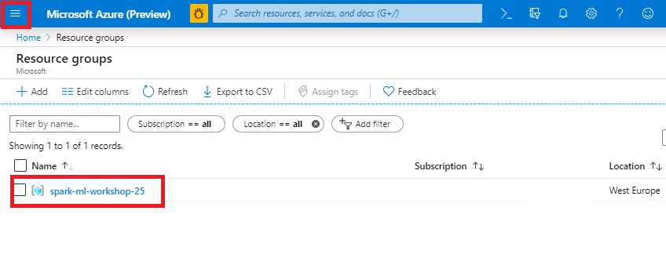

3. In the Resource Group, create a new Azure Databricks Workspace. 

 
    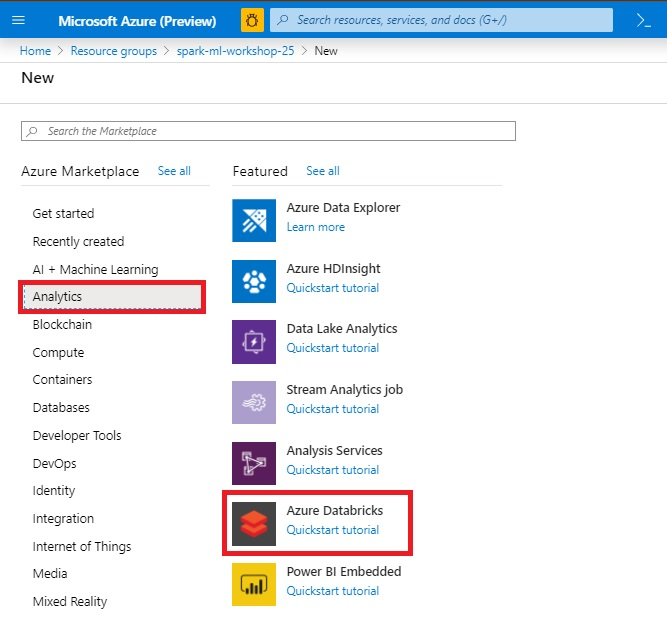

    Use  settings like the screenshot below.
 
    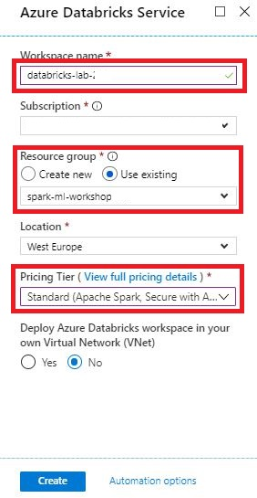

4. Navigate to the Azure Databricks Service you created, and click the **Launch Workspace** button.

    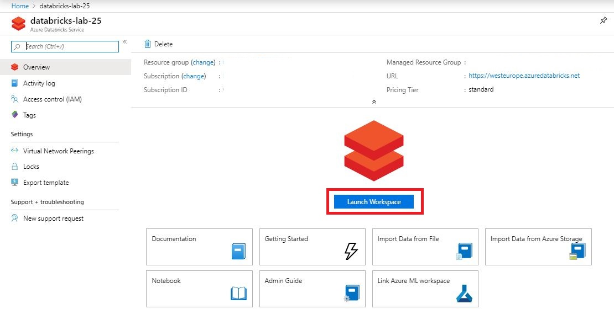

5. Create a new Cluster. Use the settings in the screenshot below.

    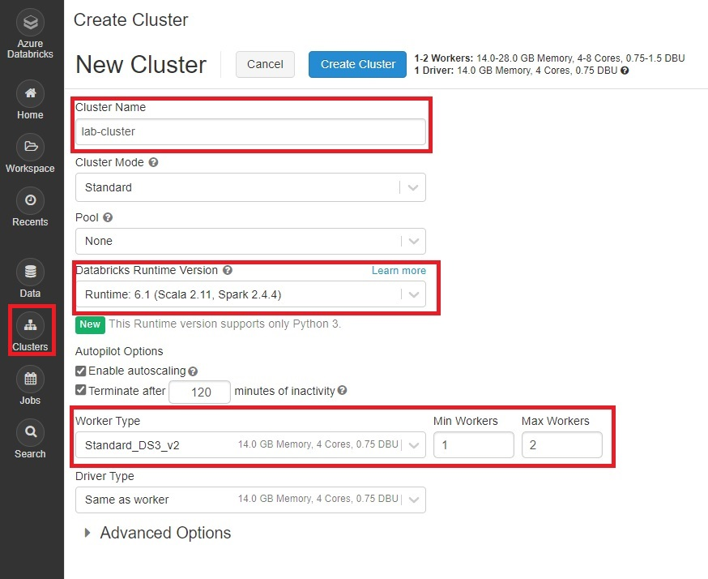

6. After the new cluster starts up, go to the cluster's **Libraries** pane and add the Python library `azureml-sdk[automl]` to the cluster, like in the images below:

    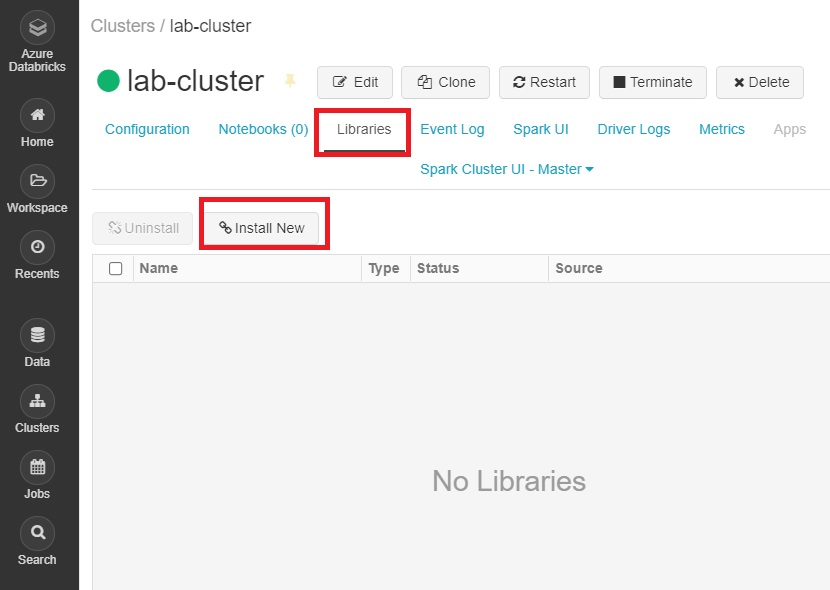

    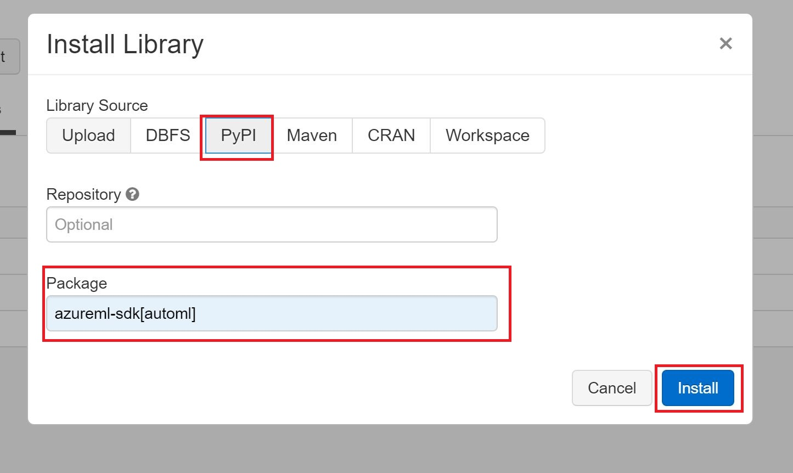

    Verify that the library has been successfully installed to the cluster.

    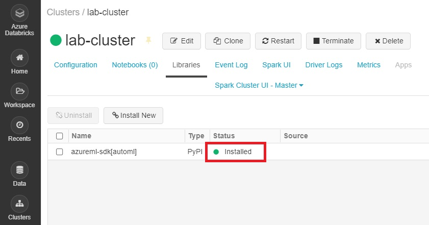

7. In the Import wizard, select **URL** and import the following two files from this Github repository:

    - https://raw.githubusercontent.com/neaorin/MLOnSparkWorkshop/master/notebooks/Databricks%20-%20Credit%20Scoring.py
    - https://raw.githubusercontent.com/neaorin/MLOnSparkWorkshop/master/notebooks/Databricks%20-%20Service%20Deployment.py

    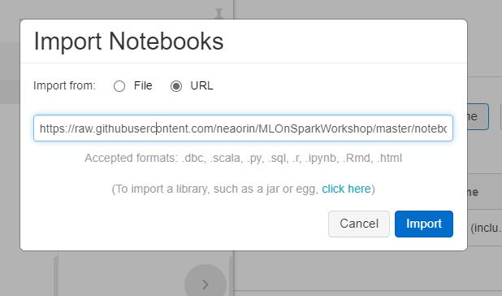

    > NOTE: You will need to perform the Import step once for each file.

8. Back in the Azure Portal, in the same Resource Group, create a new **Azure ML Service Workspace**. Use settings similar to the below screenshots.

    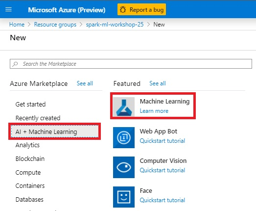

    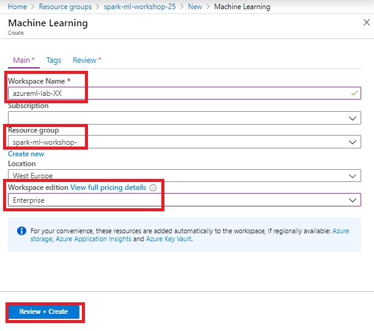

9. Back in your Azure Databricks Workspace, open the first notebook, **Databricks - Credit Scoring**. In the upper left area of the notebook window, click the *Detached* area to select a cluster to attach to and run your notebook. 

    

Congratulations! You're now done with the setup and can start using the notebooks.